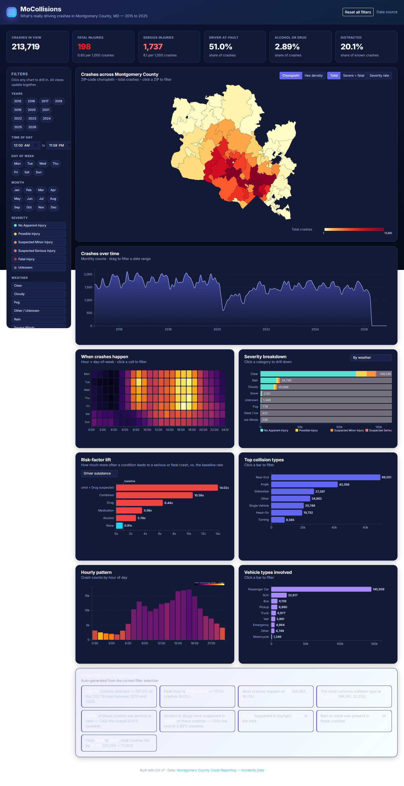

# MoCollisions

**An interactive D3 dashboard for understanding what causes crashes in Montgomery County, Maryland (2015 - 2025).**

213,719 crashes, 11 years, one cross-filtered dashboard. Click anything to filter everything.



## What it does

The Montgomery County, MD open-data portal publishes every police-reported
crash with information about weather, lighting, driver state, vehicle type,
collision geometry, and outcome severity. This dashboard turns that ~88 MB
CSV into a single coordinated view that answers questions like:

- **Where in the county do crashes concentrate?** -> a ZIP-code choropleth
  with a hex-density alternate view.
- **When are people crashing?** -> a year-by-month time series and a
  hour x day-of-week heatmap.
- **What makes a crash worse?** -> a *risk-factor lift chart* that shows,
  e.g., how much more often crashes turn serious or fatal when alcohol or
  drugs are suspected vs. the overall baseline rate.
- **What's driving the totals?** -> stacked severity bars broken down by
  weather, light, road surface, collision type, distraction, substance,
  vehicle type, or speed limit.

Every panel cross-filters every other panel. Click a year, a ZIP, a heatmap
cell, a collision type, an hour bar, a chip - the whole dashboard updates
to that slice, and the auto-generated insights panel rewrites itself to
explain what changed.

## Key findings (no filter applied)

| Metric                              | Value         |
| ----------------------------------- | ------------- |
| Total crashes 2015-2025             | 213,719       |
| Fatal crashes                       | 198           |
| Serious-injury crashes              | 1,737         |
| Share where the driver was at fault | 51.0%         |
| Share with alcohol or drugs suspected | 2.89%       |
| Share where the driver was distracted (of known) | 20.1% |

The **risk-factor lift** panel surfaces the most actionable finding:

- Crashes where alcohol + drugs were suspected are **14x more likely** to
  result in a serious or fatal injury than the baseline crash.
- Crashes in **dark, unlit** conditions are about **2x more severe** than
  the baseline.
- **Single-vehicle** crashes are roughly **3x more severe** than the
  baseline.

## Project structure

```
.
├── index.html                # Dashboard markup
├── css/styles.css            # All styles
├── js/script.js              # D3 dashboard logic (single file)
├── preprocess.py             # Build the cleaned data + ZIP GeoJSON
├── preprocessing.ipynb       # Same pipeline in a notebook
├── data/
│   ├── Crash_Reporting.csv   # Original raw export (~88 MB)
│   ├── crashes_clean.csv     # Cleaned + numerically encoded (~12 MB)
│   ├── summary.json          # Category dictionaries + metadata
│   ├── mc_zipcodes.geojson   # Filtered Montgomery County ZIP polygons
│   └── zip_aggregate.json    # Per-ZIP totals (pre-computed)
├── AI_USAGE.md               # Documentation of AI tools used
└── README.md
```

## Running it locally

You need Python (3.10+ recommended) for the one-time preprocessing step,
plus any static web server (the project uses no build step).

```bash
# 1. Install dependencies
pip install pandas shapely rtree

# 2. Preprocess (only needed once or when the raw CSV changes)
python preprocess.py

# 3. Serve the project root over HTTP
python -m http.server 8765
```

Then open <http://127.0.0.1:8765/> in any modern browser.

## Architecture

### Data pipeline (`preprocess.py`)

The raw CSV has 215 k rows and 31 columns of free-form text fields that
are inconsistently capitalised and have many near-duplicate categories
(e.g. `"No Apparent Injury"` vs. `"NO APPARENT INJURY"`, or a dozen
distinct values for *light*). The preprocessing step:

1. Drops rows with bad geometry or unparseable dates.
2. Buckets each free-text column into a small fixed set (e.g. 16 light
   categories -> 5 buckets; 28 collision types -> 8 buckets).
3. Encodes every category as a small integer index. The string names are
   written once into `summary.json` so the front-end can decode lazily.
4. Joins each crash to a Montgomery County ZIP polygon via point-in-
   polygon (using a Shapely STRtree spatial index over the OpenDataDE
   Maryland ZIP-code GeoJSON, filtered to the county's bounding box).
5. Writes a 12 MB encoded CSV (down from 88 MB) plus the filtered ZIP
   GeoJSON containing only the 68 ZIPs that have crashes.

### Front-end (`js/script.js`)

Single source of truth: an object `state.filters` with one entry per
filter dimension. Every chart calls a setter on this object and then
calls `render()`, which:

1. Runs a single tight loop over the encoded crash array to build the
   filtered slice (no per-chart filtering).
2. Calls each `drawX(...)` function with the slice.
3. Each chart is fully responsible for re-creating its SVG on every
   render (D3 enter/update/exit isn't worth the complexity for charts
   that change shape).

The map uses one of two modes:

- **Choropleth**: each ZIP filled by `total`, `severe + fatal`, or
  `severe-rate` (severe / total). The legend updates with the metric.
- **Hex density**: filtered crash points projected via D3-mercator and
  binned with `d3-hexbin`.

### Cross-filtering

Every interactive element either:

- Mutates `state.filters` and calls `render()` (e.g. clicking a chip,
  ZIP region, heatmap cell, collision bar).
- Or mutates a *view setting* (`state.mapMode`, `state.severityBy`,
  `state.riskBy`) and calls only the affected `drawX` function.

The active-filter chip row above the grid is rebuilt from
`state.filters` on every render, and clicking the small "x" on a chip
removes that single filter value.

### Risk-factor lift chart

For each category `c` of the selected dimension, we compute:

```
severity_rate(c) = severe + fatal crashes in c / total crashes in c
lift(c) = severity_rate(c) / overall severity_rate
```

A lift of 1.0 means the category is no more dangerous than average; 2.0
means twice as dangerous. We only show categories with at least 50
crashes in the current slice to keep small-sample noise out.

## Team

Solo project (Dheer)

## Data source

[Montgomery County Maryland - Crash Reporting Incidents Data](https://catalog.data.gov/dataset/crash-reporting-incidents-data)

## Tech

- [D3 v7](https://d3js.org/) and [d3-hexbin](https://github.com/d3/d3-hexbin)
- [Bootstrap 5](https://getbootstrap.com/) (utility classes only)
- [OpenDataDE Maryland ZIP-code GeoJSON](https://github.com/OpenDataDE/State-zip-code-GeoJSON)
- Vanilla JS + pandas/shapely for preprocessing
